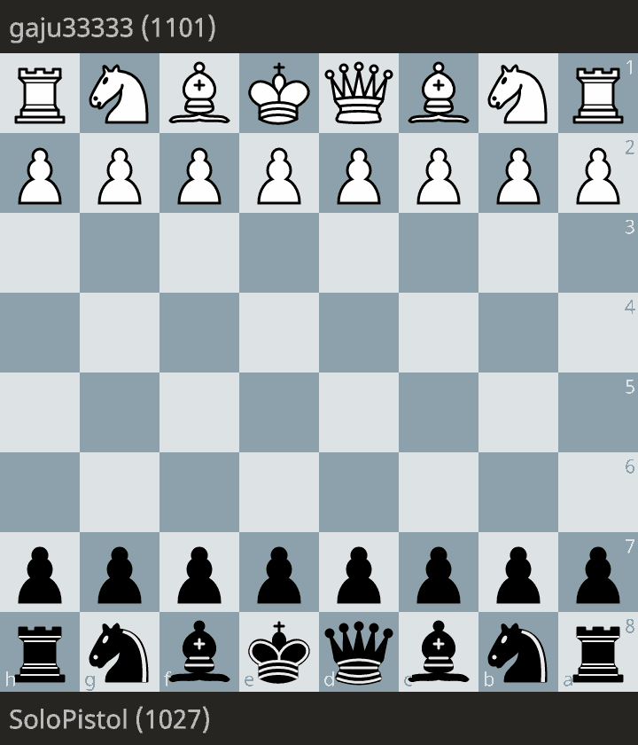

# Chess Highlights

## Overview
Two rapid games that show tactical conversion and comeback play: a 15-move checkmate on Chess.com and a resilient Lichess win against a higher-rated opponent.

## Highlight Games
| Date | Opponent | Platform | Result | Why it matters |
| --- | --- | --- | --- | --- |
| 2026-02-27 | Woaheee | Chess.com | Win (White, 1-0) | Clean tactical finish with a direct king attack and forced mate. |
| 2026-03-03 | gaju33333 | Lichess | Win (Black, 0-1) | Comeback win against 1101 after early pressure and material swings. |

## Key Moves and Turning Points
- [**15. Qxe7#** (Chess.com analyzer)](https://www.chess.com/analysis/game/live/165298129986/analysis?move=29): immediate checkmate after queen infiltration.
- [**18...Nxb2** (Lichess)](https://lichess.org/nujVa4n7#36): wins queenside material and flips initiative.
- [**26...Qxe2** (Lichess)](https://lichess.org/nujVa4n7#52): tactical conversion of central pressure into a clear advantage.
- [**34...Qxc7** (Lichess)](https://lichess.org/nujVa4n7#68): forces queen simplification and leads directly to resignation.

## Study/Analysis Links
- [Chess.com game](https://www.chess.com/game/live/165298129986?move=0)
- [Chess.com analysis](https://www.chess.com/analysis/game/live/165298129986/analysis)
- [Lichess game](https://lichess.org/nujVa4n7)
- [Lichess study chapter](https://lichess.org/study/9tKdUwCn/7y3AQeFe)

## How to View the Games
Open either PGN from `games/2026-02-27-fast-checkmate.pgn` or `games/2026-03-03-comeback-vs-gaju33333.pgn` in Chess.com or Lichess analysis boards, or import into any PGN viewer.

## Engine Analysis
- Generate analysis with `python3 analyze_pgn.py <pgn-path>`.
- Markdown is written automatically to `analysis/<game-name>.md`.
- Output is POV-oriented to `SoloPistol` by default; override with `--pov-player "<name>"`.
- Output includes a `## Significant Swings` section with turning points, engine evidence, and coaching notes.
- Tune swing reporting with:
  - `--swing-threshold-score <float>` (default `0.15`, i.e. 15 expected-score points)
  - `--swing-max-events <int>` (default `8`)
  - `--swing-scope both|pov|opponent` (default `both`)
- Choose explanation depth:
  - `--cause-mode heuristic` (fast labels only)
  - `--cause-mode forensic` (Stockfish + Lc0 evidence; default)
  - `--cause-mode forensic-llm` (forensic + optional local `llama-cli` rewrite)
- `forensic` / `forensic-llm` fail fast if `lc0` or weights are missing.
- Forensic mode options:
  - `--lc0-path <path>` and `--lc0-weights <path>` (auto-detected when omitted)
  - `--forensic-time-ms <int>` (default `700`)
  - `--forensic-multipv <int>` (default `3`)
  - `--forensic-max-pv-plies <int>` (default `6`)
- Optional local LLM rewrite options:
  - `--llama-cli-path <path>`
  - `--llama-model <path.gguf>`
  - `--llama-timeout-ms <int>` (default `6000`)
  - `--llama-max-tokens <int>` (default `180`)
  - `--llama-temperature <float>` (default `0.2`)
- Use `--output-md "<path>"` for a custom output file, or `--output-md -` to print to stdout.
- Local stack bootstrap script (requires sudo): `bash scripts/install_local_ai_stack.sh`
- Local setup details: `docs/LOCAL_AI_SETUP.md`

Visual highlight:

## Next goals
- Reduce early opening inaccuracies in Sicilian structures.
- Convert winning positions with fewer time-pressure blunders.
- Add one annotated highlight game each week.
